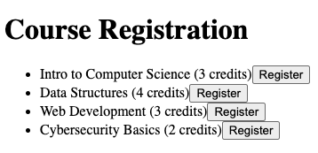

# chaiku

This is a sample web application showcasing a multi-tier architecture using **Node.js**, **Python (Flask)**, **PostgreSQL**, and **nginx**.

The app is available in two versions:
- **Legacy version** with traditional upstream container images.
- **Chainguard version** using minimal, secure-by-default, zero to near-zero CVE container images.

---

## Getting Started

### Prerequisites
- [Docker](https://www.docker.com/) - Building and Running the Application(s)
- [grype](https://github.com/anchore/grype) - Scanning Container Images for Vulnerabilities
- [Cosign](https://docs.sigstore.dev/cosign/system_config/installation/) - Downloading Attestations and Verifying signatures

Clone this directory and `cd` into it from your terminal: 
```bash
git clone https://github.com/bakenfazer/chaiku && cd chaiku
```

---

## 1. Build and Run the Legacy Version


```bash
docker compose up -d --build
```

### Verify It’s Running

Open [http://localhost:80](http://localhost:80) in your browser to view the website. You should see the following:



Check that the backend API works by running:

```bash
curl http://localhost:5000
```

You should see the following response: `Hooray! The API works.`

### Scan Legacy Images for CVEs

```bash
./scanners/grype-scan.sh
```

This will save your results to `./scanners/scan-results/grype-legacy-images.csv`.

---

## 2. Tear Down the Legacy Stack

To clean everything, including volumes:

```bash
docker compose down -v
```

---

## 3. Build and Run the Chainguard Version

```bash
docker compose -f docker-compose-chainguard.yaml up -d --build
```

### Verify It’s Running

- Open [http://localhost:80](http://localhost:80)

- Check the API:

```bash
curl http://localhost:5000/
```

### Scan Chainguard Images for CVEs

```bash
./scanners/grype-scan.sh
```

This will save your results to `./scanners/scan-results/grype-chainguard-images.csv`.

---

## 4. Tear Down the Chainguard Stack

To clean everything, including volumes:

```bash
docker compose down -v
```

---
## 5. Compare Results

After scanning both versions, open the CSV files to review the outputs to compare:

- Total CVEs
- Severity levels (Critical, High, etc.)
- Image size and dependency differences

This highlights the value of using Chainguard's minimal, secure-by-default images like those from Chainguard.

## 6. Extra Credit

### Image Specifications

Each Chainguard image has published specifications at:
`https://images.chainguard.dev/directory/image/<image-name>/specifications`

For example, the **node** Production image runs as a non-root user by default, has no apk package manager, ships without a shell, and uses a minimal set of environment variables:

| Property | Value |
|---|---|
| Has apk? | No |
| Has a shell? | No |
| User | 65532 (non-root) |
| Entrypoint | /usr/bin/node |
| Working Directory | /app |

Raw configuration is also available in JSON format on the specifications page, useful for automation and policy enforcement.

Note: For each image, Chainguard provides a "-dev" variant that includes a shell and a package manager. 

---

### Verifying Image Provenance

Chainguard images are signed with [Sigstore](https://docs.sigstore.dev/) and include verifiable attestations. You'll need `cosign` and `jq` installed.

#### Verify the Image Signature

```bash
cosign verify \
  --certificate-oidc-issuer=https://token.actions.githubusercontent.com \
  --certificate-identity=https://github.com/chainguard-images/images/.github/workflows/release.yaml@refs/heads/main \
  public.ecr.aws/chainguard/node | jq
```

#### Attestation Types

Each image ships with three attestation types:

| Attestation | Description |
|---|---|
| `https://slsa.dev/provenance/v1` | How and where the image was built (SLSA 1.2) |
| `https://apko.dev/image-configuration` | Exact build config — dependencies, users, entrypoint |
| `https://spdx.dev/Document` | Full SBOM — every package inside the image |

#### Download an Attestation (SBOM Example)

```bash
cosign download attestation \
  --platform=linux/amd64 \
  --predicate-type=https://spdx.dev/Document \
  public.ecr.aws/chainguard/node | jq -r .payload | base64 -d | jq .predicate
```

Swap `--predicate-type` to pull a different attestation. Use https://apko.dev/image-configuration for Image Configuration and https://slsa.dev/provenance/v1 for Provenance. 

#### Verify an Attestation Signature

```bash
cosign verify-attestation \
  --type https://spdx.dev/Document \
  --certificate-oidc-issuer=https://token.actions.githubusercontent.com \
  --certificate-identity=https://github.com/chainguard-images/images/.github/workflows/release.yaml@refs/heads/main \
  public.ecr.aws/chainguard/node | jq
```

A successful result confirms:
- Claims were validated
- Existence verified in the transparency log
- Certificate verified against a trusted certificate authority

---

### Resources

| Resource | URL |
|---|---|
| Chainguard Image Directory | https://images.chainguard.dev/directory |
| node provenance | https://images.chainguard.dev/directory/image/node/provenance |
| node specifications | https://images.chainguard.dev/directory/image/node/specifications |